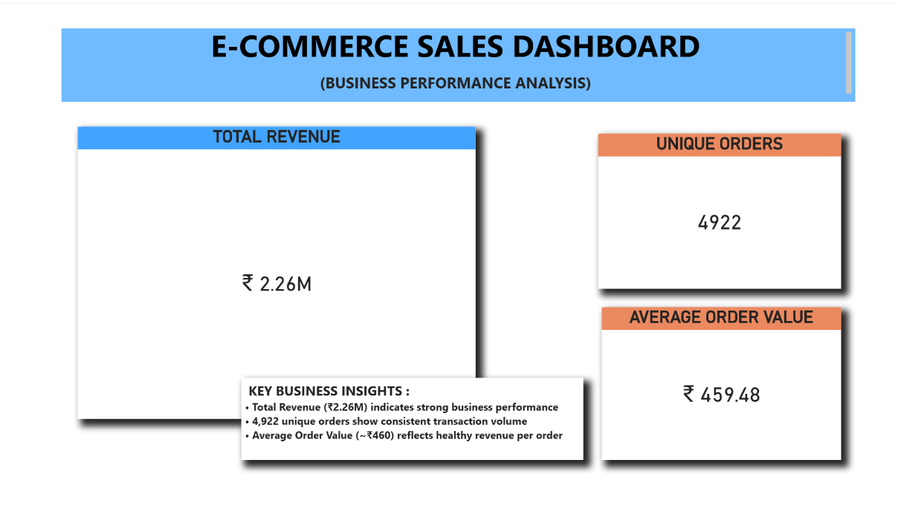
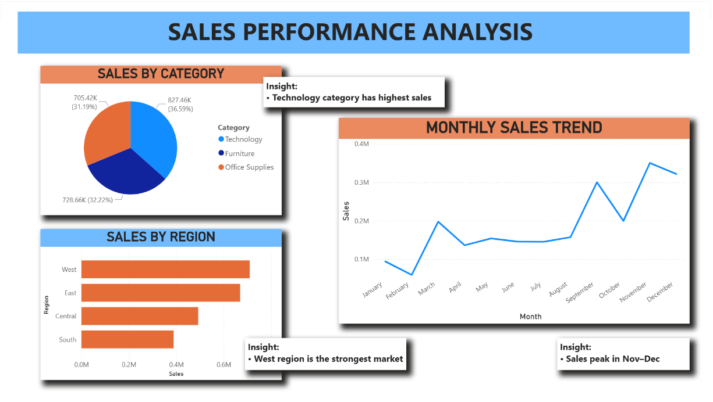
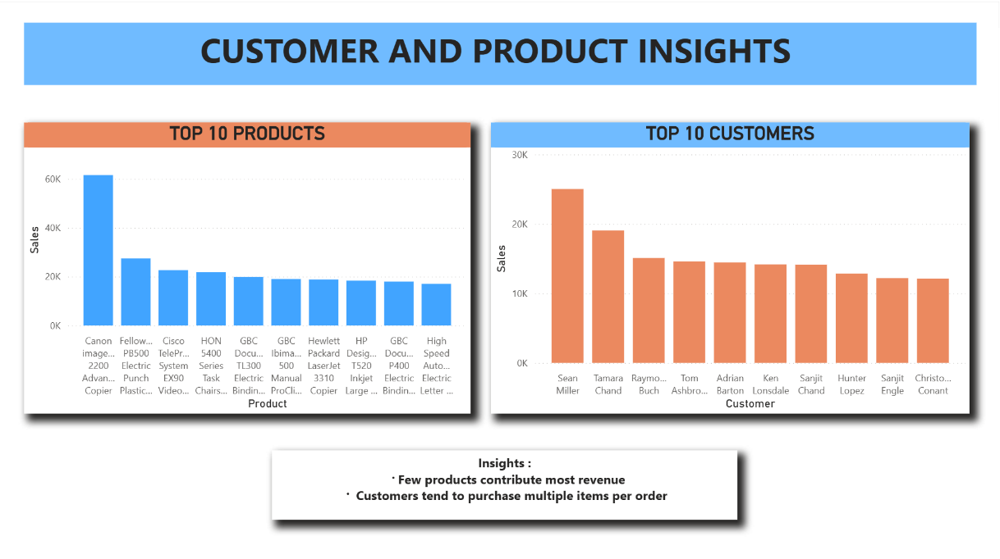

# 📊 E-Commerce Sales Analysis Dashboard

## 📌 Project Overview

This project focuses on analyzing e-commerce sales data to uncover meaningful business insights and build an interactive dashboard using Power BI.

The objective is to understand overall business performance, identify key revenue drivers, and analyze customer purchasing behavior.

---

## 🛠️ Tools & Technologies Used

* Python (Pandas for data cleaning & analysis)
* Power BI (Dashboard creation & visualization)
* CSV Dataset

---

## 📊 Key Metrics

* **Total Revenue:** ₹2.26M
* **Unique Orders:** 4,922
* **Average Order Value (AOV):** ~₹460

---

## 📈 Key Insights

* Technology category generates the highest sales among all categories
* West region is the top-performing market in terms of revenue
* Sales show a strong upward trend during November and December
* A small group of products contributes significantly to total revenue
* Customers tend to purchase multiple items per order, increasing overall order value

---

## 📊 Dashboard Structure

### 1️⃣ Executive Overview

* KPI Cards: Total Revenue, Unique Orders, Average Order Value
* Summary of key business insights

### 2️⃣ Sales Performance Analysis

* Sales by Category
* Sales by Region
* Monthly Sales Trend

### 3️⃣ Product & Customer Insights

* Top 10 Products by Revenue
* Top Customers by Revenue

---

## 📸 Dashboard Preview

---

## 📄 Full Dashboard Report

Download the complete dashboard (PDF):
👉 dashboard/E-Commerce Sales Analysis.pdf

---

## 🚀 Project Workflow

1. Data Cleaning and preprocessing using Python
2. Exploratory Data Analysis (EDA) to identify patterns
3. Creation of business KPIs and metrics
4. Dashboard development in Power BI
5. Insight generation and storytelling

---

## 🎯 Conclusion

This project demonstrates end-to-end data analysis, including data preparation, business insight generation, and dashboard development. It highlights the ability to transform raw data into actionable insights.

---

## 📬 Contact

* **LinkedIn:** https://www.linkedin.com/in/sai-roshini-mosa/
* **Email:** [sairoshini2477@gmail.com](mailto:sairoshini2477@gmail.com)
